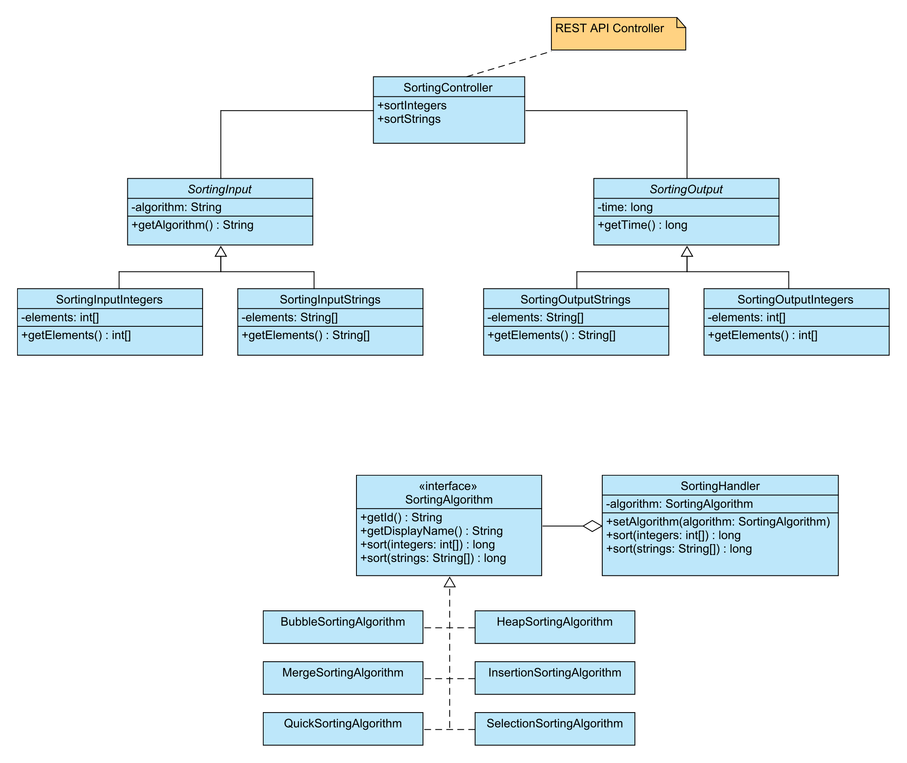

# IO-projekt 
**Sorting Madness** - aplikacja służąca do sortowania zbiorów danych różnymi algorytmami. Ma pomóc użytkownikowi w ocenie, która metoda może się najlepiej sprawdzić w uporządkowaniu danych. 

Aplikacja pozwala na wybranie następujących algorytmów dla posortowania jednowymiarowych zbiorów danych (liczb całkowitych oraz łańcuchów znaków):
   - Bubble Sort
   - Heap Sort 
   - Insertion Sort
   - Merge Sort
   - Quick Sort
   - Selection Sort

Na wyjściu aplikacja zwraca posortowany zbiór danych oraz czas wykonania sortowania dla każdego z wybranych algorytmów. 

Aplikacja jest dostępna poprzez GUI, a także zdalnie poprzez REST, dzięki czemu można zintegrować narzędzie z już istniejącymi aplikacjami.

## How to build

Aby zbudować projekt, uruchom polecenie w katalogu projektu:
```
mvn install
```

## Uruchomienie
Plik ```.jar``` pojawi się w katalogu ```target/``` katalogu głównym projektu po zbudowaniu projektu.
Można go uruchomić z wiersza poleceń (terminala) za pomocą polecenia:
 ```
 java -jar sortingmadness-1.0.0.jar
 ```
 
Domyślnie uruchamiany jest tylko serwer REST API. 

Aby również uruchomić interfejs graficzny (GUI), do polecenia musi być dodany  argument ```--gui ```:
```
java -jar sortingmadness-1.0.0.jar --gui
```


#### Javadoc
Dla zgenerowania dokumentacji technicznej, można uruchomić następujące polecenie w katalogu głównym projektu:
```
mvn javadoc:javadoc
```
Następnie w katalogu ```target/``` należy wyszukać katalog pod nazwą ```apidocs``` oraz uruchomić plik ```index.html```. 


## REST API

Serwer jest uruchamiany lokalnie z portem 8080 (localhost:8080). 
Aby przetestować żądania, można użyć dowolnego dostępnego narzędzia lub polecenia curl (Windows), na przykład żądania GET do sortowania liczb:

``` 
curl -X GET localhost:8080/integers -H "Content-Type: application/json" -H "Accept:
application/json" -d "{\"algorithm\":\"bubble\",\"elements\":[5,2,1,0,3]}"  
```

Otrzymany wynik:
```{"code":0,"msg":null,"data":{"time":0,"elements":[0,1,2,3,5]}}```

Wartości ```code``` i ```msg``` służą do wyświetlania statusu odpowiedzi. Jeśli kod wynosi 0, żądanie spełnia wszystkie wymagania (jest prawidłowe). W innych przypadkach:
1001 - Nieznany algorytm (jest zwracany, jeśli identyfikator ID jest nieprawidłowy)
1002 - Elementy są ustawione nieprawidłowo (więcej szczegółów w ```msg```)

Do pracy wykorzystywane są dwie trasy: ```/integers``` и ```/strings``` do sortowania odpowiednio liczb całkowitych i łańcuchów znaków.
Dane wejściowe są zgodne z ```SortingInput``` w kodzie, wyjściowe - z  ```SortingResponse<SortingOutput>```. 
Nazwę (ID) każdego algorytmu można znaleźć w odpowiedniej klasie jego implementacji:

- Bubble Sort: ```bubble```
- Heap Sort: ```heap```
- Insertion Sort: ```insertion```
- Merge Sort: ```merge```
- Quick Sort: ```quick```
- Selection Sort: ```selection```


## UML Diagram:


## Dodatkowe informacje/pliki:

[Sorting Madness.xlsx](https://onedrive.live.com/edit.aspx?resid=9DBD128686E05269!3566&ithint=file%2cxlsx&authkey=!ALdSodD-8Qm6dzY)

[Trello](https://trello.com/b/tmQee0hb/sorting-madness) + skonfigurowane Github Issues

Zespół:

- Darya Makarevich 150245 (**Proxy Product Owner**, Developer)
- Mikita Navadnichy 150206 (**Scrum Master**, Developer)


